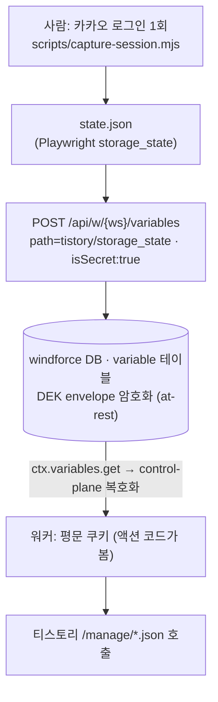

# 세션 인증과 시크릿 흐름

발행/조회 액션은 사용자의 **티스토리 로그인 세션 쿠키**로 인증한다. 이 쿠키는 카카오 로그인 세션이라 민감하므로, **어디에 어떻게 저장되고 누가 평문으로 보는지**를 명확히 한다.

## 한눈에 — 쿠키 라이프사이클



핵심: **쿠키는 job 실행마다 전달하지 않는다.** 사전에 한 번 변수로 등록하면, 액션이 실행 시점에 `ctx.variables.get`으로 가져온다. job input(`{title, content, blog, ...}`)에는 쿠키가 없다.

## 1) 세션 추출 (사람, 1회)

카카오 봇 차단 때문에 자동 로그인은 못 한다. 사람이 실제 창에서 1회 로그인한다.

```
node scripts/capture-session.mjs ./state.json
```

`state.json`은 Playwright `storage_state` 형식(쿠키 + 오리진)이다. 발행에 필요한 건 `tistory.com` 도메인 쿠키뿐이며(`TSSESSION` 등, [tistory-internal-api.md](./tistory-internal-api.md) 참고), `lib/tistory.ts`의 `buildCookieHeader`가 이를 추출한다.

## 2) windforce 변수로 등록 (암호화 at-rest)

```
POST /api/w/{ws}/variables   { "path":"tistory/storage_state", "value":<state.json>, "isSecret":true }
POST /api/w/{ws}/variables   { "path":"tistory/blog",          "value":"<blog>" }
```

- `variable` 테이블(`workspace_id, path, value, is_secret, description`)에 워크스페이스 단위로 저장된다.
- **`isSecret:true`면 DEK envelope 암호화**되어 저장된다(`KEK(SECRET_KEY env) → 워크스페이스별 DEK → AES-GCM`). DB의 `value`는 base64 암호문이고, 디스크에 평문은 없다.
- 워크스페이스 삭제 시 DEK를 폐기하면 해당 시크릿은 복구 불가(crypto-shredding).

> ⚠️ **필드명은 `isSecret`(camelCase)다.** 핸들러 구조체에 JSON 태그가 없어 Go 기본 매칭(case-insensitive지만 **언더스코어는 매칭 안 함**)을 쓰므로, `is_secret`(snake)로 보내면 **무시되어 평문 저장**된다. 세션 쿠키가 평문으로 남으면 안 되므로 반드시 `isSecret`로 보낸다.

## 3) 런타임 사용 (복호화 → 평문)

액션이 `ctx.variables.get("tistory/storage_state")`를 호출하면:
1. SDK 래퍼가 control-plane API(`GET /variables/get/p/...`)를 호출하고,
2. 서버가 `is_secret`이면 복호화해 **평문 값**을 반환하며,
3. 워커의 액션 코드가 그 값으로 Cookie 헤더를 만들어 티스토리에 보낸다.

## 신뢰 경계

- **암호화는 저장 구간(at-rest)에만** 적용된다. 액션 코드(작성자가 쓴 `publish`/`list`)는 **복호화된 쿠키를 평문으로 다룬다** — windforce는 "작성자 코드를 신뢰"하는 모델이기 때문이다.
- 워커는 샌드박스에서 **외부 egress**로 티스토리에 요청한다.
- KEK는 환경별로 다르다: 로컬 dev-stack은 dev용 키, 운영(클러스터)은 별도 `SECRET_KEY`(SOPS/sealed로 관리).
- 세션 만료 시 **변수만 1회 재등록**하면 된다(액션/코드 변경 불필요). 다른 워크스페이스와 격리된다.

## 검증된 사실 (dev-stack)

- `isSecret:true` 등록 후 DB `value`가 평문 JSON → base64 암호문으로 바뀌고 `is_secret=t`가 됨을 확인.
- 암호화된 변수로 `tistory.list`/`tistory.publish`가 정상 동작(복호화 경로) 확인.
